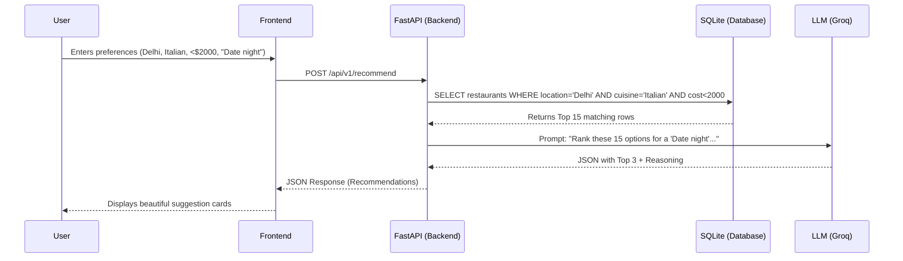

# Detailed Architecture: AI-Powered Restaurant Recommendation System

This document provides an in-depth, component-level architectural blueprint for the Zomato AI project. It breaks down the data flow, internal schemas, API contracts, and specific technologies for each phase of the system.

---

## System Context & Flow

The system operates on a **Retrieve-and-Generate (RAG-lite)** pattern. Rather than sending the entire dataset to an LLM (which is impossible due to token limits), the backend will first use traditional SQL/Database filtering to retrieve a "Candidate Pool" of restaurants matching the hard constraints (location, budget), and then pass that small pool to the LLM to perform nuanced reasoning, ranking, and explanation generation.



---

## Phase 1: Data Ingestion & Engineering

**Objective:** Transform raw, unstructured Hugging Face data into a query-optimized local database.

### 1.1 Data Source Pipeline (`scripts/ingest_data.py`)
*   **Tooling:** Python, `datasets` library, `pandas`, `sqlite3`.
*   **Extraction:** Download dataset `ManikaSaini/zomato-restaurant-recommendation` via API.
*   **Transformation (Cleaning):**
    *   `Cost`: Convert string formats (e.g., "₹ 1,200 for two") into integers (`1200`).
    *   `Rating`: Handle "NEW" or "-" values by setting them to `NULL` or `0`. Cast to `float`.
    *   `Cuisines`: Clean comma-separated strings for exact-match searching.
    *   `Location`: Normalize capitalization and trim whitespace.

### 1.2 Database Schema (SQLite: `restaurants.db`)
We use SQLite for simplicity and fast reads.
**Table: `restaurants`**
| Column Name | Data Type | Notes |
| :--- | :--- | :--- |
| `id` | TEXT (PK) | Unique identifier |
| `name` | TEXT | Name of the restaurant |
| `location` | TEXT | Normalized location string |
| `cost_for_two` | INTEGER | Parsed integer value |
| `rating` | REAL | Float (0.0 to 5.0) |
| `votes` | INTEGER | Number of reviews |
| `cuisines` | TEXT | Comma-separated list |
| `url` | TEXT | Zomato page link (if available) |

*Indexes will be created on `location`, `cost_for_two`, and `rating` to speed up the retrieval phase.*

---

## Phase 2: Backend Integration & Pre-filtering

**Objective:** Securely handle requests and perform the initial "Hard Filter".

### 2.1 Backend Framework Setup
*   **Framework:** FastAPI (Python). Chosen for its async support, which is critical when waiting for slow LLM API responses.
*   **Directory Structure:**
    ```text
    backend/
    ├── main.py           # FastAPI application & routing
    ├── database.py       # SQLite connection & queries
    ├── schemas.py        # Pydantic models for request/response validation
    └── ai_service.py     # LLM integration logic
    ```

### 2.2 Data Access Layer (`database.py`)
*   Function `get_candidate_restaurants(preferences)`:
    *   Constructs a dynamic SQL query based on user input.
    *   Example: `SELECT * FROM restaurants WHERE location LIKE '%{loc}%' AND cost_for_two <= {budget} AND rating >= {min_rating} ORDER BY rating DESC LIMIT 15`
    *   Returns a list of dictionaries (The Candidate Pool).

---

## Phase 3: AI Recommendation Engine (The Core)

**Objective:** Orchestrate the LLM to analyze the Candidate Pool and generate personalized responses.

### 3.1 Prompt Architecture (`ai_service.py`)
*   **Tooling:** LangChain (Optional) or direct HTTP requests to the Groq API. The Groq API key will be stored securely in a `.env` file.
*   **System Prompt:** 
    > "You are ZomatoAI, an expert food critic and personalized dining assistant. Your goal is to review a provided list of candidate restaurants and select the top 3 that best match the user's specific request. Provide a compelling, 2-sentence explanation for WHY each restaurant is a perfect fit."
*   **Context Injection:** The Candidate Pool is serialized to JSON or a Markdown table and injected into the prompt.
*   **User Prompt:** The raw, nuanced text from the user (e.g., "I want a quiet place with great dessert for an anniversary").

### 3.2 Structured Output Enforcement
To ensure the frontend can render the response, we force the LLM to output structured JSON using tools like OpenAI's JSON Mode or LangChain's Output Parsers.

**Target Output Schema:**
```json
{
  "recommendations": [
    {
      "restaurant_name": "Truffles",
      "ai_reasoning": "Truffles is highly rated for its desserts and offers a cozy ambiance perfect for an anniversary, all while staying within your budget.",
      "match_score": 95
    }
  ]
}
```

---

## Phase 4: API Endpoint Design

**Objective:** Define the contract between the frontend and backend.

### 4.1 `POST /api/v1/recommend`
**Request Payload (Pydantic Model):**
```json
{
  "location": "Bangalore",
  "budget_max": 1500,
  "cuisine_preference": "Italian",
  "min_rating": 4.0,
  "additional_context": "Looking for a quiet anniversary spot with good desserts."
}
```

**Response Payload:**
The backend merges the original database rows with the LLM's reasoning.
```json
{
  "status": "success",
  "results": [
    {
      "name": "Truffles",
      "location": "Koramangala, Bangalore",
      "rating": 4.5,
      "cost_for_two": 1200,
      "cuisines": "Italian, Desserts",
      "ai_explanation": "Truffles is highly rated for its desserts and offers a cozy ambiance perfect for an anniversary..."
    }
  ]
}
```

### 4.2 Helper Endpoints
*   `GET /api/v1/locations` - Returns unique locations to populate the frontend dropdown.
*   `GET /api/v1/cuisines` - Returns unique cuisines.

---

## Phase 5: Frontend UI Development

**Objective:** Build a premium, dynamic, and responsive user interface.

### 5.1 Tech Stack
*   **Framework:** Next.js (React) using the App Router.
*   **Styling:** TailwindCSS with Zomato brand identity (Red `#e23744`, clean white backgrounds, and light gray surfaces).
*   **State Management:** React `useState` and `useEffect`.

### 5.2 Component Architecture
1.  **`Navbar`**: Static top bar with Zomato branding and navigation links.
2.  **`HeroSection`**: A visually striking red-to-dark gradient background framing the main form.
3.  **`SearchCard`**: A central white container holding:
    *   Conversational text input bar ("What are you craving today?") with a red Send button.
    *   Quick-select pills (Italian, Spicy, Dessert, Near Me).
    *   A structured 2x2 grid for Location, Cuisine, Budget, and Min Rating.
    *   A full-width red "Get Recommendations" button.
4.  **`ResultsGrid`**: 
    *   Renders `RestaurantCard` components in a 2-column layout.
    *   Implements an animated "Finding the best matches..." loading state.
5.  **`RestaurantCard`**: 
    *   Horizontal layout. Food image placeholder on the left.
    *   Right side displays Name, Rating, and Cost.
    *   Includes a distinct, light-pink box explicitly highlighting the `ai_explanation` ("AI Reason:").

---

## Phase 6: Deployment

**Objective:** Host the application to make it accessible to users over the internet.

### 6.1 Backend Deployment
*   **Platform:** Streamlit Cloud (or Streamlit-compatible hosting)
*   **Details:** The FastAPI backend (or its Streamlit-adapted equivalent, depending on the final wrapper) is hosted here to serve the core logic, perform database queries, and interact with the Groq LLM API.

### 6.2 Frontend Deployment
*   **Platform:** Vercel
*   **Details:** The Next.js React frontend is deployed on Vercel for fast, edge-optimized content delivery, providing a seamless and highly responsive user interface that communicates with the deployed backend.
